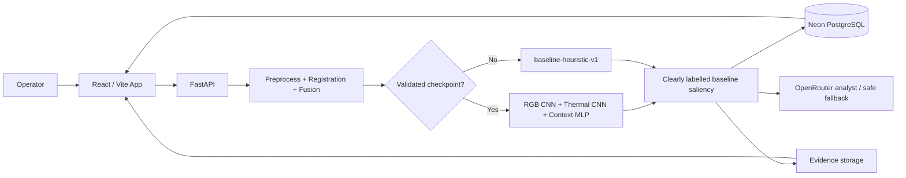

# EvoThermGuard

**Environment-Aware Evolutionary Deep Learning for Multispectral Thermal Anomaly Detection**

EvoThermGuard is a full-stack, decision-support platform for thermal inspection of transformer and electrical equipment. It combines an RGB image, a thermal image and submitted environmental context into a traceable inspection record with generated visual evidence and operator-facing guidance.

> Research integrity: EvoThermGuard does not diagnose equipment failure, guarantee a failure prediction, or replace qualified engineering review. Thermal visualisation images are not treated as radiometric temperature matrices.

## What is implemented

- JWT account registration, sign-in, protected routes and owner-scoped data access.
- Equipment registry; inspection creation; JPEG/PNG validation; UUID evidence storage outside the database.
- OpenCV preprocessing, ORB/homography registration with low-confidence fallback, and registered RGB/thermal visual fusion.
- A real PyTorch multimodal architecture: RGB ResNet-18 branch + thermal ResNet-18 branch + an MLP for environmental context associated with each image pair.
- True gradient-based Grad-CAM and an explicit circle/bounding region labelled **Inspect this area** whenever a validated CNN checkpoint is active. Baseline runs remain clearly labelled thermal saliency—not Grad-CAM.
- A strict labelled manifest contract with train/validation/test splits, four risk labels, optional localization masks, file validation, and reproducible experiment artifacts.
- Held-out accuracy, macro precision/recall/F1, multiclass ROC-AUC, confusion matrix, and mask-based localization IoU/Dice where labels permit.
- Opt-in NSGA-II hyperparameter search using validation F1 and validation loss as its two objectives; the test split is never an optimization objective.
- The deterministic `baseline-heuristic-v1` remains available as the comparison and runtime fallback until a genuine checkpoint is supplied.
- Tiered notifications: Normal creates no alert, Warning creates a dashboard warning, High Risk creates dashboard + email, and Critical creates a prominent dashboard alert + email. Email delivery activates only when SMTP is configured.
- OpenRouter integration only for narrative explanation. It gets structured inspection data and fails safely to deterministic language; inference never waits on it.
- React command-center UI with responsive layout, mobile dock, evidence grid and scientific positioning.
- Training and optimisation scaffolding; model lab deliberately presents no fake metrics or NSGA-II records.

## Architecture



## Project layout

```text
EvoThermGuard/
├── frontend/                 React, TypeScript, Vite command center
├── backend/
│   ├── app/                  FastAPI API, models, services, ML modules
│   ├── ml_training/          labelled-data training / evaluation scaffolding
│   ├── alembic/              migration configuration
│   └── storage/              local development evidence only
├── docker-compose.yml
├── .env.example
└── README.md
```

## Local setup

1. Copy `.env.example` to `.env` and configure `DATABASE_URL` for Neon PostgreSQL. The checked-in development fallback is SQLite only for local exploration.
2. Create and activate a Python 3.11 environment, then install backend dependencies:

   ```bash
   cd backend
   pip install -r requirements.txt
   alembic revision --autogenerate -m "initial schema"
   alembic upgrade head
   uvicorn app.main:app --reload
   ```

3. In another terminal start the frontend:

   ```bash
   cd frontend
   npm install
   npm run dev
   ```

Open `http://localhost:5173`; API health is available at `http://localhost:8000/health` and `http://localhost:8000/api/v1/health`.

## Configuration

| Variable | Purpose |
| --- | --- |
| `DATABASE_URL` | Neon async PostgreSQL URL (`postgresql+asyncpg://…`) |
| `JWT_SECRET` | long random production signing secret |
| `FRONTEND_URL` | exact allowed frontend origin |
| `MODEL_MODE` | `demo` by default; use `trained` only with a reviewed real checkpoint |
| `MODEL_CHECKPOINT` | trained checkpoint location |
| `DATASET_MANIFEST` | labelled paired-sample manifest shown by model status |
| `EXPERIMENTS_PATH` | completed JSON experiment artifact directory |
| `OPENROUTER_API_KEY` | optional explanation service key; never frontend-exposed |
| `STORAGE_PATH` | evidence directory (local development only) |
| `SMTP_HOST`, `SMTP_PORT` | optional High Risk / Critical email transport |
| `SMTP_USERNAME`, `SMTP_PASSWORD`, `SMTP_FROM_EMAIL` | optional SMTP credentials and sender |

## API overview

- `POST /api/v1/auth/register`, `POST /auth/login`, `GET /auth/me`
- `GET|POST /api/v1/equipment`
- `POST /api/v1/inspections`, `POST /inspections/{id}/images`, `POST /inspections/{id}/analyze`
- `GET /api/v1/inspections`, `GET /inspections/{id}`, `GET /inspections/{id}/result`
- `POST /api/v1/inspections/{id}/feedback`, `GET /api/v1/alerts`
- `POST /api/v1/ai/inspections/{id}`, `GET /api/v1/models/status`, `GET /api/v1/experiments`

## Dataset and real model workflow

The application never treats operator-entered weather values as a separate dataset. Every row represents one labelled paired observation: RGB + thermal + its associated environmental context. Copy `backend/dataset/manifest.example.csv` to `backend/dataset/manifest.csv`, then add real field evidence and these required fields:

`sample_id,rgb_path,thermal_path,ambient_temperature,humidity,weather,season,time_of_day,sun_exposure,label,split`

Labels must be `NORMAL`, `WARNING`, `HIGH_RISK`, or `CRITICAL`; splits must be `train`, `validation`, and `test`. Add `mask_path` when a reviewed anomaly-region mask exists.

Run the ablation matrix from `backend/`:

```bash
python -m ml_training.train --manifest dataset/manifest.csv --modality rgb
python -m ml_training.train --manifest dataset/manifest.csv --modality thermal
python -m ml_training.train --manifest dataset/manifest.csv --modality fusion
python -m ml_training.train --manifest dataset/manifest.csv --modality fusion_env
python -m ml_training.optimize --manifest dataset/manifest.csv
```

Each completed run writes its real configuration, manifest hash, learning history, held-out metrics, confusion matrix, and localization scores to `backend/models/experiment-*.json`. The Model Lab reads only those artifacts; it never displays invented metrics.

To activate a reviewed checkpoint, install the full training requirements in the inference image, set `MODEL_MODE=trained`, and set `MODEL_CHECKPOINT` to the saved `multimodal-fusion_env-best.pt`. Without all three conditions, the software keeps `baseline-heuristic-v1` active and reports the reason through `/api/v1/models/status`.

## Docker

```bash
copy .env.example .env
docker compose up --build
```

Use a Neon database; the compose stack deliberately does not create a local Postgres service. For production, deploy `frontend` to Vercel, `backend` to Railway, set `VITE_API_URL` to the Railway `/api/v1` URL, allow the Vercel origin through `FRONTEND_URL`, and replace local evidence storage with S3/R2/Supabase Storage—Railway disk is ephemeral.

## Research position

The complete software baseline and multispectral processing platform are implemented. The trainable multimodal network, true Grad-CAM runtime path, evaluation suite, and evolutionary search are now implemented as reproducible research code. Actual research claims remain pending until properly labelled field data is supplied, the ablation runs complete, and results are independently reviewed. The heuristic system remains the explicit baseline for comparison.

Production still requires durable object storage for evidence. Railway filesystems are ephemeral unless a volume or external S3-compatible store is configured.
