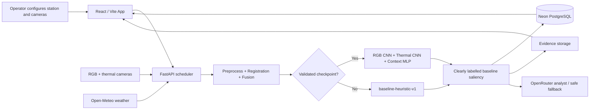

# EvoThermGuard

**Environment-Aware Evolutionary Deep Learning for Multispectral Thermal Anomaly Detection**

EvoThermGuard is a full-stack, decision-support platform for automatic thermal monitoring of transformer and electrical equipment. Every ten minutes it pairs RGB and thermal camera snapshots, associates coordinate-derived weather context, and creates a traceable inspection record with generated visual evidence and operator-facing guidance.

> Research integrity: EvoThermGuard does not diagnose equipment failure, guarantee a failure prediction, or replace qualified engineering review. Thermal visualisation images are not treated as radiometric temperature matrices.

## What is implemented

- JWT account registration, sign-in, protected routes and owner-scoped data access.
- Equipment registry plus station/camera monitoring setup; automatic ten-minute paired captures; JPEG/PNG validation; UUID evidence storage outside the database.
- Latitude/longitude weather enrichment through Open-Meteo. Station and weather values are snapshotted into each inspection so historical evidence remains immutable.
- OpenCV preprocessing, ORB/homography registration with low-confidence fallback, and registered RGB/thermal visual fusion.
- A real PyTorch multimodal architecture: RGB ResNet-18 branch + thermal ResNet-18 branch + an MLP for environmental context associated with each image pair.
- True gradient-based Grad-CAM and an explicit circle/bounding region labelled **Inspect this area** whenever a validated CNN checkpoint is active. Baseline runs remain clearly labelled thermal saliency—not Grad-CAM.
- A strict labelled manifest contract with train/validation/test splits, four risk labels, optional localization masks, file validation, and reproducible experiment artifacts.
- Held-out accuracy, macro precision/recall/F1, multiclass ROC-AUC, confusion matrix, and mask-based localization IoU/Dice where labels permit.
- Opt-in NSGA-II hyperparameter search using validation F1 and validation loss as its two objectives; the test split is never an optimization objective.
- The deterministic `baseline-heuristic-v1` remains available in explicit demo mode for comparison until a genuine checkpoint is supplied; trained-model failures never silently switch to this baseline.
- Tiered notifications: Normal creates no alert, Warning creates a dashboard warning, High Risk creates dashboard + email, and Critical creates a prominent dashboard alert + email. Email delivery activates only when SMTP is configured.
- OpenRouter integration only for narrative explanation. It gets structured inspection data and fails safely to deterministic language; inference never waits on it.
- React command-center UI with responsive layout, mobile dock, evidence grid and scientific positioning.
- Training and optimisation scaffolding; model lab deliberately presents no fake metrics or NSGA-II records.

## Architecture


```mermaid
flowchart LR
  O[Operator configures station and cameras] --> R[React / Vite App]
  R --> F[FastAPI scheduler]
  X[RGB + thermal cameras] --> F
  W[Open-Meteo weather] --> F
  F --> P[Preprocess + Registration + Fusion]
  P --> M{Validated checkpoint?}
  M -->|Yes| C[RGB CNN + Thermal CNN + Context MLP]
  M -->|No| B[baseline-heuristic-v1]
  C --> G[True Grad-CAM + localized region]
  B --> G[Clearly labelled baseline saliency]
  G --> D[(Neon PostgreSQL)]
  G --> S[Evidence storage]
  G --> A[OpenRouter analyst / safe fallback]
  D --> R
  S --> R
```

## Project layout

```text
EvoThermGuard/
├── frontend/                 React, TypeScript, Vite command center
├── backend/
│   ├── app/                  FastAPI API, models, services, ML modules
│   ├── ml_training/          labelled-data training / evaluation scaffolding
│   ├── alembic/              migration configuration
│   └── storage/              local development evidence only
├── docker-compose.yml
├── .env.example
└── README.md
```

## Local setup

1. Copy `backend/.env.example` to `backend/.env` and configure `DATABASE_URL` for your development database and `JWT_SECRET`. The checked-in development fallback is SQLite only for local exploration. Run backend commands from the `backend` folder so this environment file and relative dataset paths resolve correctly.
2. Create and activate a Python 3.11 environment, then install backend dependencies:

   ```bash
   cd backend
   pip install -r requirements.txt
   alembic upgrade head
   uvicorn app.main:app --reload
   ```

3. In another terminal start the frontend:

   ```bash
   cd frontend
   npm install
   npm run dev
   ```

Open `http://localhost:5173`; API health is available at `http://localhost:8000/health` and `http://localhost:8000/api/v1/health`.

### Using and testing camera feeds on localhost

You can run the app locally and use either the hosted camera URLs or the bundled local datasets. In both cases, enter the **same pair endpoint in the RGB camera snapshot URL and Thermal camera snapshot URL fields**. Grey example text is a placeholder; both fields must contain an actual URL.

Create `frontend/.env` with:

```env
VITE_API_URL=http://localhost:8000/api/v1
```

Set `FRONTEND_URL=http://localhost:5173` in `backend/.env`. Restart the frontend and backend after changing their environment files.

#### Option 1: Local app with hosted dataset URLs

Your local backend can fetch matching image pairs from the deployed Railway service. Internet access is required. You do not need to enable the local camera simulation endpoint for this option.

| Select this asset | Paste this URL into both camera fields |
| --- | --- |
| Feeder Motor M-204 | `https://evothermgaurd-production.up.railway.app/camera/datasets/motor-m-204/pair` |
| Transformer T-01 | `https://evothermgaurd-production.up.railway.app/camera/datasets/transformer-t-01/pair` |
| Main Switchgear SG-12 | `https://evothermgaurd-production.up.railway.app/camera/datasets/switchgear-sg-12/pair` |

#### Option 2: Local app with locally served datasets

Use the bundled images in `backend/dataset/cameras`. Add or update these settings in `backend/.env`:

```env
CAMERA_SIMULATION_ENABLED=true
CAMERA_DATASETS_PATH=./dataset/cameras
CAMERA_PUBLIC_BASE_URL=http://localhost:8000
```

Start the backend from `backend` after running `alembic upgrade head`. These examples assume Uvicorn uses port 8000:

| Select this asset | Paste this URL into both camera fields |
| --- | --- |
| Feeder Motor M-204 | `http://localhost:8000/camera/datasets/motor-m-204/pair` |
| Transformer T-01 | `http://localhost:8000/camera/datasets/transformer-t-01/pair` |
| Main Switchgear SG-12 | `http://localhost:8000/camera/datasets/switchgear-sg-12/pair` |

Open `http://localhost:8000/camera/datasets` to check feed readiness. Opening a pair endpoint returns JSON containing the pair ID and both image URLs; this is expected. If you change the backend port, update the frontend API URL, camera base URL and camera fields together. Local image replay still fetches current weather through Open-Meteo, which requires internet access.

#### Manual workflow check

1. Open `http://localhost:5173`, sign in or create an account, then go to **Live Monitoring**.
2. Select an available asset, enter a station name and latitude/longitude, and paste its corresponding pair URL into **both** camera fields.
3. Enable **automatic ten-minute monitoring** and click **Save monitoring setup**.
4. Click **Capture now**. The completed inspection should show RGB, thermal and fused evidence, baseline thermal saliency, environmental context and a risk result.
5. Return to Live Monitoring and capture again to obtain the next pair. Each installed feed contains four pairs, then repeats; different pairs may produce the same risk category.
6. Leave monitoring enabled and the backend running. Check **Inspections** after the displayed next-capture time for the next automatic inspection. Use **Pause** to stop scheduled captures.

Pump P-07 and Generator G-03 feeds are unavailable and return 503. The available feeds replay real archived recordings; they are not live station cameras. The transformer recording is an instrument/current transformer, and the switchgear recording shows a cabinet exterior. Risk results remain unvalidated demo outputs; displayed confidence is not measured prediction accuracy.

#### Automated backend tests

With the backend requirements installed, run this from `backend`:

```bash
python -m pytest tests -q
```

Tests create temporary fixtures and test databases or mock external requests. They do not require the hosted camera URLs or a running local server. Fixture images exercise software behavior and are not evidence of model accuracy. Install the full `backend/requirements.txt`, including PyTorch and torchvision, before running the complete suite.

## Configuration

| Variable | Purpose |
| --- | --- |
| `DATABASE_URL` | Neon async PostgreSQL URL (`postgresql+asyncpg://…`) |
| `JWT_SECRET` | long random production signing secret |
| `FRONTEND_URL` | exact allowed frontend origin |
| `MODEL_MODE` | `demo` by default; use `trained` only with a reviewed real checkpoint |
| `MODEL_CHECKPOINT` | trained checkpoint location |
| `DATASET_MANIFEST` | labelled paired-sample manifest shown by model status |
| `EXPERIMENTS_PATH` | completed JSON experiment artifact directory |
| `OPENROUTER_API_KEY` | optional explanation service key; never frontend-exposed |
| `STORAGE_PATH` | evidence directory (local development only) |
| `SMTP_HOST`, `SMTP_PORT` | optional High Risk / Critical email transport |
| `SMTP_USERNAME`, `SMTP_PASSWORD`, `SMTP_FROM_EMAIL` | optional SMTP credentials and sender |
| `MONITORING_POLL_SECONDS` | scheduler polling cadence; captures remain fixed at ten minutes |
| `WEATHER_API_URL` | Open-Meteo current-weather endpoint |

## API overview

- `POST /api/v1/auth/register`, `POST /auth/login`, `GET /auth/me`
- `GET|POST /api/v1/equipment`
- `GET|POST /api/v1/monitoring/sources`, `PATCH /monitoring/sources/{id}`
- `POST /api/v1/monitoring/sources/{id}/capture-now` (connection test / operator-triggered test)
- `POST /api/v1/inspections`, `POST /inspections/{id}/images`, `POST /inspections/{id}/analyze`
- `GET /api/v1/inspections`, `GET /inspections/{id}`, `GET /inspections/{id}/result`
- `POST /api/v1/inspections/{id}/feedback`, `GET /api/v1/alerts`
- `POST /api/v1/ai/inspections/{id}`, `GET /api/v1/models/status`, `GET /api/v1/experiments`

## Dataset and real model workflow

### Dataset-backed camera-feed simulation

The backend supports separate paired datasets for each equipment asset without changing either camera URL field or the UI design. Enable `CAMERA_SIMULATION_ENABLED=true`, set `CAMERA_DATASETS_PATH=./dataset/cameras`, and run `alembic upgrade head`. `GET /camera/datasets` lists the available feeds. Enter the **same asset-specific pair URL in both RGB and thermal camera fields**:

| Equipment | URL path on your backend |
| --- | --- |
| Transformer T-01 | `/camera/datasets/transformer-t-01/pair` |
| Generator G-03 | `/camera/datasets/generator-g-03/pair` |
| Cooling Pump P-07 | `/camera/datasets/pump-p-07/pair` |
| Main Switchgear SG-12 | `/camera/datasets/switchgear-sg-12/pair` |
| Feeder Motor M-204 | `/camera/datasets/motor-m-204/pair` |

The bundled feeds now contain **12 recorded observations / 24 real camera images** from [InspecSafe-V1](https://huggingface.co/datasets/Tetrabot2026/InspecSafe-V1), CC BY 4.0. They show a current transformer, an electrical distribution cabinet exterior and an industrial motor, mapped to corresponding demo asset IDs. The transformer is not a distribution transformer. These are archived recordings replayed by the API, not live station cameras. Pump and electrical-generator feeds report unavailable (503): synthetic fixtures have been removed, with no unrelated substitutes.

Each capture selects once and acquires both immutable image URLs for that pair ID. Dataset, modality, pair ID and checksum checks prevent cross-asset or cross-pair substitution. Persistent database cursors advance sequentially per dataset and source (001 -> 002 -> 003 -> 004 -> 001). Catalog reads and pinned images do not advance selections; previews have separate cursors.

Both modalities come from the same original waypoint's recordings. Hardware synchronization is unverified: transformer/cabinet frames use equal relative video times; motor infrared frames use +1 second to match displayed clocks to the nearest second. These are not certified simultaneous-exposure ground truth. Each dataset.json records original video members, hashes, frame times, actual equipment type and license. Colorized thermal frames are not radiometric arrays; the existing baseline risk model remains unvalidated. These files have not been used to train or validate a model.

The ten-minute scheduler runs validation, preprocessing, registration, fusion, analysis and alerts with separately retrieved current station weather. Source provenance and synchronization limitations persist in inspection metadata. Weather belongs to the replay timestamp, not the original location/date. The frontend design and both camera URL fields remain unchanged.

For future genuine recordings, add matching RGB_<id>.jpg / Thermal_<id>.jpg in a safe lowercase folder inside CAMERA_DATASETS_PATH, with attribution and correspondence evidence in dataset.json. See [recorded feed setup](backend/dataset/cameras/README.md). The legacy /camera/pair uses CAMERA_DATASET_PATH with no bundled images. Separate real JPEG/PNG camera endpoints remain supported.

The application never treats operator-entered weather values as a separate dataset. Every row represents one labelled paired observation: RGB + thermal + its associated environmental context. Copy `backend/dataset/manifest.example.csv` to `backend/dataset/manifest.csv`, then add real field evidence and these required fields:

`sample_id,capture_group,rgb_path,thermal_path,ambient_temperature,humidity,weather,season,time_of_day,sun_exposure,label,split`

`capture_group` identifies a recording session (or an entire asset/site for stricter generalization tests). Keep all related observations in the same split. Validation rejects groups and decoded image content reused across splits, including renamed lossless copies. Curators must still review near duplicates, label correctness and RGB/thermal correspondence. All four risk classes must occur in training; environmental values must be finite. Risk labels require equipment expertise and appropriate measurements, not guesses from image brightness.

Labels must be `NORMAL`, `WARNING`, `HIGH_RISK`, or `CRITICAL`; splits must be `train`, `validation`, and `test`. Add `mask_path` when a reviewed anomaly-region mask exists.

Run the ablation matrix from `backend/`:

```bash
python -m ml_training.train --manifest dataset/manifest.csv --modality rgb
python -m ml_training.train --manifest dataset/manifest.csv --modality thermal
python -m ml_training.train --manifest dataset/manifest.csv --modality fusion
python -m ml_training.train --manifest dataset/manifest.csv --modality fusion_env
python -m ml_training.optimize --manifest dataset/manifest.csv
```

Each completed run writes its real configuration, manifest hash, learning history, held-out metrics, confusion matrix, and localization scores to `backend/models/experiment-*.json`. The Model Lab reads only those artifacts; it never displays invented metrics.

Evaluation fixes macro metrics to all four risk classes, reports class support/recall and missed Critical examples, and distinguishes missing classes from successful detection. Completing a test does not automatically validate a checkpoint. Default **project targets**, configurable through training CLI arguments, are macro F1 >= 0.95, Critical recall >= 0.98 and >= 50 held-out observations per class. Passing these targets is not engineering certification, calibration or guaranteed accuracy on other assets. Report uncertainty and evaluate each asset type/site separately before operational use.

NSGA-II candidates use validation only and do not evaluate the test split. Freeze the chosen parameters before evaluating the final model once; do not tune thresholds against the final test results. A trained-model load/inference failure fails the inspection rather than silently substituting a heuristic result. Baseline confidence and similarity weights are explicitly marked as uncalibrated heuristic outputs. Colorized thermal intensity is not calibrated temperature. The supplied recorded camera images have no verified four-tier risk labels: no trained model or measured accuracy is being claimed.

Localization overlays remain on the model branch's native image: thermal Grad-CAM on thermal, RGB Grad-CAM on RGB. Baseline saliency also stays on thermal. An unverified RGB/thermal registration never justifies drawing thermal coordinates on an RGB photo. Optional localization masks must use the evaluated branch's coordinate system; binary masks use nearest-neighbor resize and the same augmentation flip as both inputs.

To activate a reviewed checkpoint, install the full training requirements in the inference image, set `MODEL_MODE=trained`, and set `MODEL_CHECKPOINT` to the checkpoint path in its experiment JSON. Each run retains its own checkpoint rather than overwriting earlier experiments. Trained mode fails if the checkpoint/runtime is unavailable or class ordering differs; it never switches to a heuristic. Set `MODEL_MODE=demo` explicitly to run the unvalidated baseline. `/api/v1/models/status` reports the active model and its project acceptance result.

## Docker

```bash
copy .env.example .env
docker compose up --build
```

Use a Neon database; the compose stack deliberately does not create a local Postgres service. For production, deploy `frontend` to Vercel, `backend` to Railway, set `VITE_API_URL` to the Railway `/api/v1` URL, allow the Vercel origin through `FRONTEND_URL`, and replace local evidence storage with S3/R2/Supabase Storage—Railway disk is ephemeral.

## Research position

The complete software baseline and multispectral processing platform are implemented. The trainable multimodal network, true Grad-CAM runtime path, evaluation suite, and evolutionary search are now implemented as reproducible research code. Actual research claims remain pending until properly labelled field data is supplied, the ablation runs complete, and results are independently reviewed. The heuristic system remains the explicit baseline for comparison.

Production still requires durable object storage for evidence. Railway filesystems are ephemeral unless a volume or external S3-compatible store is configured.
